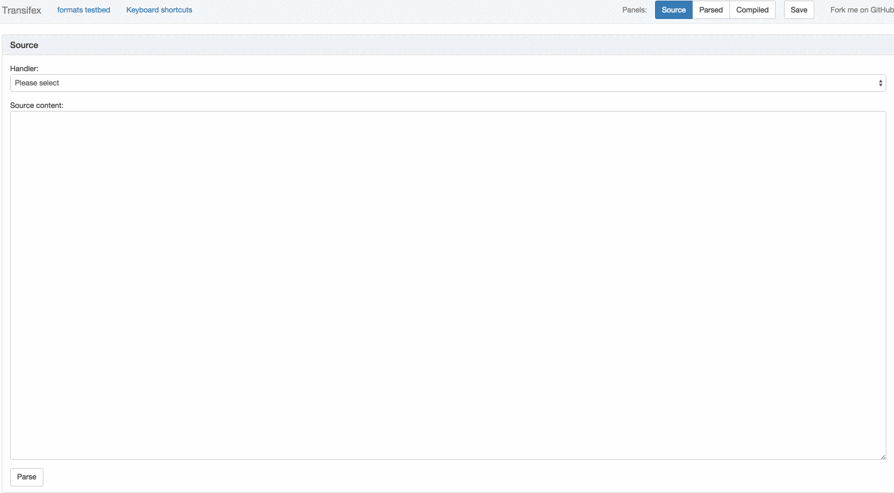

.. _testbed:

The testbed
###########

The testbed is a real-time `django`_ web application included with the openformats
library to help you develop, test and debug format handlers. To start it,
simply run::

    ./manage.py runserver

and point your browser to ``http://localhost:8000``

The interface consists of 3 columns, one for each state of the handler's
lifetime.

.. image:: images/openformats-testbed-screencast.gif

.. _django: https://www.djangoproject.com/

The source column
=================

From here you choose which file format you want to play around with. The list
is automatically populated by all sublasses of `Handler` defined in all modules
in ``openformats/formats``.

Once you select one, you can type or paste some content in the textarea. If you
have a sample file in
``openformats/tests/formats/<format_name>/files/1_en.<extension>``, it will be
picked up by the testbed and put in the textarea automatically once you select
a format. You can of course edit or replace it if you want.

Finally, press 'parse' to, well, parse the source content. The actual handler
will be used to display the outcome in the next column:

The stringset-template column
=============================

This column shows the outcome of the previous operation: the stringset and
template extracted from the source. You can inspect entries of the stringset,
edit their content or even delete them. Once you're ready, you can press on
compile to have the handler create a language file out of the template and the,
potentially edited, stringset.

The compiled column
===================

This shows the outcome of the previous operation. There is also a message that
tells you if the compiled text matches the source, in case you didn't edit the
stringset and this is what you had expected.

Errors
======

If there's an error during the parsing or compiling operation, a full traceback
will be printed on the relevant column. This is helpful for both debugging and
making sure that the error messages displayed to the user when there is a
mistake in the source file is accurate and helpful.

Saving tests
============

If you run the following command::

    ./manage.py syncdb --noinput

The testbed will be able to save your current test state (chosen format,
soruce, stringset, template, compiled file) in an sqlite database and allow you
to play it back any time. This saved test can be accessed from the URL in your
browser right after you've pressed the save button.

You will probably not need to do that yourself; this is a feature intended for
the `public hosted version`_ of the testbed, so that users can provide
Transifex support or openformats contributors with test cases that reproduce a
bug.

.. _public hosted version: https://formats.transifex.com
